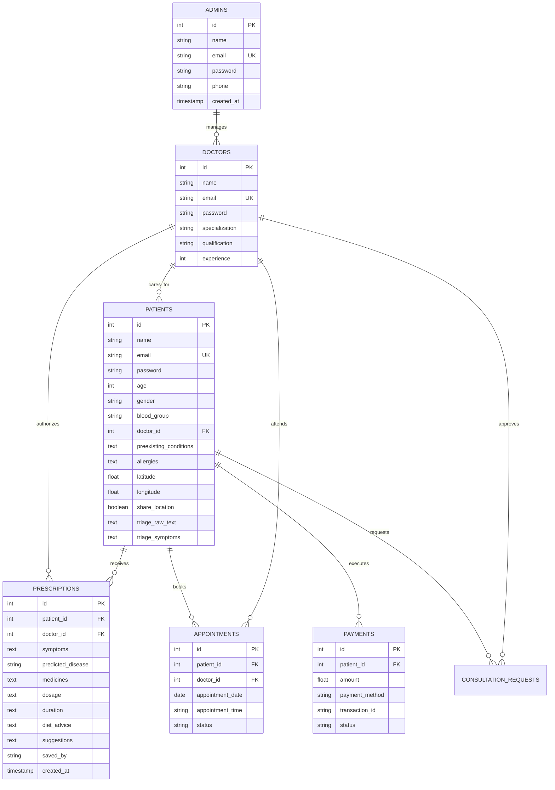

# 🌿 AyushVeda — Multimodal AI Clinical Decision Support System & Integrative Hospital Management

<div align="center">

[](https://ayush-veda-final-764u.vercel.app/)
[](https://www.python.org/)
[](https://flask.palletsprojects.com/)
[](https://scikit-learn.org/)
[](https://ai.google.dev/)
[](https://www.reportlab.com/)
[](LICENSE)

<br/>

**A production-grade, doctor-in-the-loop Clinical Decision Support System (CDSS) bridging ancient Ayurvedic therapeutics (*Tridosha & Dravyaguna*) with modern evidence-based allopathic medicine, emergency red-flag triage, multilingual voice/vision input, and full-stack hospital management.**

[Explore Live Web App](https://ayush-veda-final-764u.vercel.app/) • [Demo Credentials](#-demo-credentials) • [Key Features](#-key-features--capabilities) • [System Architecture](#-system-architecture) • [ML Methodology](#-machine-learning-diagnostic-core) • [Installation Guide](#-quick-start--local-setup)

</div>

---

## 📌 Executive Summary

Access to timely, affordable, and accurate clinical guidance remains critically restricted in rural and resource-limited regions worldwide. Existing online symptom checkers and artificial intelligence models suffer from major structural deficiencies:
1. **Unimodal & Language-Restricted**: They force users to navigate complex English medical terminology.
2. **The "Sparse Symptom" Failure**: Baseline ML models trained exclusively on full symptom sheets suffer precipitous accuracy drop-offs when real-world patients present with only 2 or 3 complaints.
3. **Absence of Critical Triage**: They evaluate severe cardiovascular emergencies (like myocardial infarction or stroke) through the same slow, asynchronous questionnaires as a mild common cold.
4. **Disconnected from Clinical Workflows**: They output standalone text predictions without providing hospital referrals, verified dual-pharmacopoeia therapeutic regimens, or licensed doctor oversight.

**AyushVeda** solves this through a unified **6-stage clinical architecture**:
- **Multimodal Ingestion**: Ingests symptoms via colloquial free-text, multilingual speech across 11 Indian regional languages, or clinical image manifestation uploads.
- **Deterministic Red-Flag Emergency Triage**: Intercepts life-threatening presentations prior to machine learning classification.
- **Combinatorial $k$-Subset Augmented Random Forest Core**: A 300-estimator ensemble delivering a **0.984 Macro F1-Score** across 41 disease categories with calibrated Top-3 differential diagnoses.
- **Dual-Pharmacopoeia Retrieval Engine**: Maps validated diagnoses to classic Ayurvedic formulations (*Churna, Vati, Kwath, Pathya/Apathya*) cross-referenced with modern supportive allopathic medicines.
- **Doctor-in-the-Loop Hospital Management (EHR)**: Full role-based access control (Admin, Doctor, Patient) with electronic health records, prescription approval, appointment scheduling, and automated PDF medical certificate generation.
- **Privacy-Preserving Geospatial Surveillance**: 1-km centroid obfuscated outbreak clustering for communicable diseases (Dengue, Malaria, Typhoid) and localized healthcare resource routing.

---

## 🔑 Demo Credentials

Test the live deployment directly across all three role-based portals:

| Role | Portal Link | Email | Password | Access Privileges |
| :--- | :--- | :--- | :--- | :--- |
| **Admin** | [`/admin/login`](https://ayush-veda-final-764u.vercel.app/admin/login) | `admin@ayushveda.com` | `admin123` | System analytics, Doctor/Patient CRUD, Scheduling, Simulated Payments |
| **Doctor** | [`/doctor/login`](https://ayush-veda-final-764u.vercel.app/doctor/login) | `doctor@ayushveda.com` | `doctor123` | Patient review, AI triage preview, Safety warnings, Prescription builder |
| **Patient** | [`/patient/login`](https://ayush-veda-final-764u.vercel.app/patient/login) | `patient@ayushveda.com` | `patient123` | Voice/Vision symptom checker, AyushBot AI, EHR history, PDF certificates |

> *Note: Seed credentials also include `admin@ayurcare.com` / `doctor@ayurcare.com` with respective passwords.*

---

## 🏛️ System Architecture

AyushVeda is engineered around an integrated 6-stage clinical pipeline with strict safety barriers and audit trails:

```
┌──────────────────────────────────────────────────────────────────────────────────────────────────┐
│                                   PATIENT / CLINICAL INGESTION                                   │
│            Natural Language Text  │  Multilingual Voice (11 Langs)  │  Gemini Vision Image        │
└────────────────────────────────────────────────┬─────────────────────────────────────────────────┘
                                                 │
                                                 ▼
┌──────────────────────────────────────────────────────────────────────────────────────────────────┐
│                             MULTIMODAL SYMPTOM NORMALIZATION GATEWAY                             │
│       Gemini 2.5 Flash Semantic Parser + Deterministic Offline Synonym Engine (132-D Vector)     │
└────────────────────────────────────────────────┬─────────────────────────────────────────────────┘
                                                 │
                                                 ▼
┌──────────────────────────────────────────────────────────────────────────────────────────────────┐
│                                 DETERMINISTIC RED-FLAG EMERGENCY TRIAGE                          │
│          Acute Coronary Syndrome, Stroke (FAST), Severe Dyspnea, Anaphylaxis, Toxic Shock        │
└───────────────────────┬──────────────────────────────────────────────────┬───────────────────────┘
                        │ [Emergency Detected]                             │ [Non-Emergency]
                        ▼                                                  ▼
┌──────────────────────────────────────────────┐  ┌────────────────────────────────────────────────┐
│             EMERGENCY PROTOCOL               │  │           ML DIAGNOSTIC CORE (RF B=300)        │
│   Immediate Red Alert, 108/112 Dispatch,     │  │   Combinatorial k-Subset Augmented Model       │
│     Nearby Emergency Hospital Guidance       │  │   Top-3 Differential Diagnoses & Confidence    │
└──────────────────────────────────────────────┘  └────────────────────────┬───────────────────────┘
                                                                           │
                                                                           ▼
┌──────────────────────────────────────────────────────────────────────────────────────────────────┐
│                                   DOCTOR CLINICAL REVIEW CONSOLE                                 │
│             Safety & Contraindication Engine: Flags Patient Allergies & Chronic Conditions       │
│                           Doctor-in-the-Loop Verification & Approval Required                   │
└────────────────────────────────────────────────┬─────────────────────────────────────────────────┘
                                                 │
                                                 ▼
┌──────────────────────────────────────────────────────────────────────────────────────────────────┐
│                                 DUAL-PHARMACOPOEIA RETRIEVAL ENGINE                              │
│         Ayurvedic Formulations (Dravya, Anupana, Pathya/Apathya) + Allopathic Cross-Reference    │
└────────────────────────────────────────────────┬─────────────────────────────────────────────────┘
                                                 │
                                                 ▼
┌──────────────────────────────────────────────────────────────────────────────────────────────────┐
│                                    HOSPITAL MANAGEMENT & EHR MODULE                              │
│   EHR Record Stored, Doctor Signed Prescriptions, ReportLab PDF Certificate, Teleconsultation    │
└────────────────────────────────────────────────┬─────────────────────────────────────────────────┘
                                                 │
                                                 ▼
┌──────────────────────────────────────────────────────────────────────────────────────────────────┐
│                                PRIVACY-PRESERVING GEOSPATIAL SURVEILLANCE                        │
│         1-km Obfuscated Infectious Clustering (Dengue, Malaria, Typhoid) + Resource Map          │
└──────────────────────────────────────────────────────────────────────────────────────────────────┘
```

---

## ✨ Key Features & Capabilities

### 1. 🎙️ Multimodal Symptom Acquisition
* **Voice-to-Text & Regional Translation (`/api/translate`)**:
  * Employs browser-native Web Speech API coupled with `deep_translator`.
  * Fully supports **11 regional languages**: Kannada (ಕನ್ನಡ), Hindi (हिन्दी), Tamil (தமிழ்), Telugu (తెలుగు), Bengali (বাংলা), Marathi (मराठी), Malayalam (മലയാളം), Urdu (اردو), Gujarati (ગુજરાતી), Punjabi (ਪੰਜਾਬੀ), and English.
* **Computer Vision Manifestation Extraction (`/api/vision_extract_symptoms`)**:
  * Utilizes Google Gemini 2.5 Flash Vision to evaluate visible clinical manifestations (e.g., skin lesions, urticaria, fungal rashes, jaundice sclera).
  * Prompts are constrained to map detected physical findings strictly into canonical symptom vocabulary tokens, returning structured JSON.
* **Semantic Natural Language Extraction (`/api/patient_extract_symptoms`)**:
  * Parses free-text colloquial input (e.g., *"my head is pounding and stomach burns after food"*) into standard feature identifiers.
* **Deterministic Keyword & Synonym Fallback**:
  * Guarantees uninterrupted operation even during third-party API downtime using an offline clinical synonym dictionary ($\mathcal{S}_{\text{final}} = \mathcal{S}_{\text{LLM}} \cup \mathcal{S}_{\text{synonym}} \cup \mathcal{S}_{\text{exact}}$).

### 2. 🚨 Deterministic Emergency Red-Flag Triage (`/api/patient_triage`)
* Evaluates incoming complaints against strict clinical emergency criteria before asynchronous probabilistic classification:
  * **Acute Coronary Syndrome**: Radiating crushing chest pain, dyspnea, cold sweats.
  * **Cerebrovascular Accident (Stroke)**: Sudden hemiparesis, facial asymmetry, slurred speech (`FAST` guidelines).
  * **Acute Respiratory Failure**: Severe breathing difficulty, cyanosis, stridor.
  * **Systemic Anaphylaxis / Toxic Hyperpyrexia**: High unremitting fever with altered consciousness or delirium.
* Bypasses standard waiting queues and renders immediate emergency action cards with regional helpline triggers (108 / 112).

### 3. 🤖 Machine Learning Diagnostic Core
* **Algorithm**: 300-estimator Random Forest Classifier ($B=300$).
* **Feature Dimension**: 132 binary symptom inputs ($D=132$).
* **Disease Classes**: 41 canonical disease categories ($C=41$).
* **Sparse Input Resilience**: Trained via **Combinatorial $k$-subset Augmentation** ($k \in \{3,4,5,6\}$), expanding training instances from 4,920 to **7,980 samples**, guaranteeing precision even when patients provide minimal symptom sets.
* **Top-3 Differential Presentation**: Soft-voting aggregation calculating calibrated probabilistic confidence across the top three clinical candidates.

### 4. 🌿 Dual-Pharmacopoeia Therapeutic Engine
* **Ayurvedic Knowledge Base (`data/ayurvedic_medicines.xlsx`)**:
  * Grounded in classical *Tridosha* (Vata, Pitta, Kapha) balance and *Dravyaguna* pharmacology.
  * Formulations categorized into standard Ayurvedic classes: *Churna, Vati/Gutika, Kwath, Asava/Arishta, Taila*.
  * Provides precise *Anupana* (administration vehicle: warm water, honey, ginger juice), *Pathya* (recommended dietary regimen), *Apathya* (strict dietary restrictions), and *Dinacharya* (lifestyle modifications and yogic practices).
* **Modern Allopathic Cross-Reference (`data/allopathic_medicines.xlsx`)**:
  * Displays supportive allopathic medications to ensure modern clinical context and integrative safety.
* **Automated Safety & Contraindication Screening**:
  * Automatically cross-references recommended herbs and compounds against the patient’s recorded pre-existing conditions (e.g., diabetes, hypertension, renal impairment) and known drug allergies.

### 5. 💬 AyushBot — Interactive AI Health Companion (`/patient/chatbot`)
* **Context-Aware Clinical LLM**:
  * Injects the patient's electronic health profile—including assigned doctor details, chronic illnesses, active prescriptions, and drug allergies—directly into the Gemini 2.5 Flash system prompt.
* **Voice Dictation & Text-to-Speech (TTS) (`/api/tts`)**:
  * Allows bidirectional voice interactions, reading clinical explanations aloud for patients with low literacy.
* **Prompt Quick-Action Chips**:
  * Rapidly assists users with queries like *"Explain my recent diagnosis"*, *"Dietary regimen for Pitta imbalance"*, or *"How to administer Triphala Churna"*.
* **Safety Boundaries**:
  * Enforces educational boundaries; refrains from altering prescriptions autonomously and immediately triages emergencies.

### 6. 🗺️ Privacy-Preserving Geospatial Surveillance (`/patient/map`)
* **1-km Centroid Obfuscation**:
  * In compliance with data privacy regulations (such as India's DPDP Act), exact patient coordinates are blurred to a 1-km grid centroid.
* **Epidemiological Cluster Heatmap (`/api/community_health`)**:
  * Tracks 14-day sliding window trends of infectious diseases (Dengue, Malaria, Typhoid, Viral Hepatitis) to assist health authorities in spotting outbreak vectors.
* **Localized Resource Finder**:
  * Seamless interactive map for locating nearby specialized hospitals, Ayurvedic clinics, and low-cost Jan Aushadhi pharmacies.

### 7. 🏥 Hospital Management & Clinical EHR Ecosystem
* **Role-Based Portals**:
  * **Patient Portal**: AI Symptom Checker, Personal Treatment History, PDF Certificate Generator, Doctor Consultations (Phone & Video).
  * **Doctor Portal**: Assigned Patient Queue, AI Triage Review, Differential Diagnosis Review, Interactive Prescription Builder, Safety Warning Acknowledgment.
  * **Admin Portal**: System Analytics, Doctor & Patient CRUD, Doctor Reassignment with Audit Trail, Appointment Queuing, Simulated Payment Invoicing (Card, Cash, UPI).
* **Tamper-Resistant PDF Generation (`ReportLab`)**:
  * Automated generation of formal Medical Assessment Certificates containing verification stamps, symptoms list, dietary rules, and legal disclaimers.

---

## 📊 Machine Learning Diagnostic Core

### Problem Formulation
Each clinical case is encoded as a high-dimensional binary symptom vector $\mathbf{x} = [x_1, x_2, \dots, x_D]^T \in \{0, 1\}^{132}$ where $x_j = 1$ indicates the presence of symptom $j$. The target space comprises $C = 41$ disease classes. The goal is to estimate the class probability distribution:

$$P(Y = y_k \mid \mathbf{x}) = \frac{1}{B} \sum_{b=1}^{B} P_b(Y = y_k \mid \mathbf{x}), \quad B = 300$$

### Why Conventional Naïve Bayes Fails in Clinical Practice
Standard Bayesian classifiers rely on the assumption of conditional independence among symptom features:

$$P(Y = y_k \mid \mathbf{x}) \propto P(Y = y_k) \prod_{j=1}^{D} P(x_j \mid Y = y_k)$$

In clinical medicine, symptoms are inherently correlated. For instance, *yellowish_skin*, *yellowing_of_eyes*, and *dark_urine* are collinear physiological manifestations of hyperbilirubinemia. Naïve Bayes over-penalizes missing correlated symptoms and produces overconfident, skewed distributions.

### Combinatorial $k$-Subset Augmentation
To solve the "sparse symptom presentation" dilemma, AyushVeda introduces combinatorial subset sampling during data preprocessing:

$$\mathcal{C}_k(\Omega_k) = \{\sigma \subseteq \Omega_k : |\sigma| = k\}, \quad k \in \{3, 4, 5, 6\}$$

Where $\Omega_k$ is the canonical symptom set for disease $y_k$. Subsets are sampled uniformly (capped at 25 combinations per $k$) and encoded as training vectors. This expanded the benchmark dataset to **7,980 instances**, teaching the Random Forest to accurately diagnose diseases from incomplete symptom presentations.

### Benchmark Evaluation & Comparison

AyushVeda's Random Forest model was empirically evaluated against 5 baseline classifiers across identical test partitions of the Kaggle Disease Symptom Prediction benchmark:

| Algorithm Model | Accuracy | Precision | Recall | Macro F1-Score |
| :--- | :---: | :---: | :---: | :---: |
| Gaussian Naïve Bayes | 0.864 | 0.871 | 0.864 | 0.861 |
| Logistic Regression | 0.929 | 0.934 | 0.929 | 0.928 |
| Decision Tree (Single) | 0.941 | 0.946 | 0.941 | 0.940 |
| $k$-Nearest Neighbors ($k=5$) | 0.932 | 0.938 | 0.932 | 0.931 |
| Support Vector Machine (RBF) | 0.965 | 0.969 | 0.965 | 0.966 |
| **AyushVeda Random Forest ($B=300$)** | **0.984** | **0.986** | **0.984** | **0.984** |

### Robustness & Latency Analysis
* **Clinical Outpatient Suite**: Tested against an independent 30-case outpatient clinical scenario suite reflecting sparse, real-world presentations across acute and chronic conditions. AyushVeda achieved **30/30 (100%) correct primary identification**.
* **Inference Latency Breakdown**:
  * Random Forest Inference: **18.4 ms**
  * Therapeutic Database Retrieval: **4.2 ms**
  * Synonym Normalization: **1.1 ms**
  * Vision Manifestation Parsing (Gemini API): **840 ms**
  * Total Text End-to-End Pipeline Latency: **< 120 ms**

---

## 💻 Tech Stack & Engineering Specifications

| Layer | Technologies Used | Description |
| :--- | :--- | :--- |
| **Backend Framework** | Python 3.10+, Flask 3.0+ | Lightweight, multi-threaded microframework serving 57 API/web endpoints |
| **Database & ORM** | SQLite 3 (`ayurcare.db`) | Relational database handling 7 core tables with foreign-key integrity |
| **Machine Learning** | Scikit-Learn, NumPy, Pandas, Joblib | 300-tree Random Forest with automatic retraining & fallback logic |
| **Generative AI & Vision** | Google Gemini 2.5 Flash API (`google-genai`) | Multimodal LLM for symptom extraction, visual triage, and chatbot |
| **Natural Language & Audio** | Deep-Translator, Web Speech API, gTTS | Speech recognition, translation across 11 languages, TTS audio playback |
| **Document Compilation** | ReportLab 4.0+ | Automated, dynamic PDF compilation of stamped medical certificates |
| **Frontend & UI/UX** | HTML5, CSS3 (Vanilla Design System), JavaScript | Responsive layout, custom herbal/clinical palette (`#2D5016`, `#E8611A`) |
| **Geospatial Mapping** | OpenStreetMap, Leaflet, Google Maps Embed | Privacy-preserving epidemic clustering and healthcare facility discovery |

---

## 🗄️ Database Architecture

AyushVeda uses a normalized SQLite schema structured for clinical accountability and audit logging:



---

## 📂 Project Directory Structure

```
AyushVeda-Final/
├── app.py                            # Core Flask application (57 routes, auth, APIs, logic)
├── requirements.txt                  # Python dependencies & libraries
├── README.md                         # Comprehensive project documentation
├── Ayushveda_IEEE_Research_Paper.md  # Full academic IEEE paper manuscript
├── Ayushveda_IEEE_Conference_Paper.tex # LaTeX conference paper source
├── ayurcare.db                       # Relational SQLite database
├── .env                              # Environment configuration (GEMINI_API_KEY)
├── .env.example                      # Environment template
│
├── ml_model/                         # Machine learning assets & scripts
│   ├── train_model.py                # Combinatorial k-subset training pipeline
│   ├── disease_model.pkl             # Serialized 300-tree Random Forest model
│   ├── symptoms_list.pkl             # Canonical 132-symptom feature ontology
│   ├── training_data.csv             # Kaggle training benchmark dataset
│   └── test_data.csv                 # Held-out evaluation test partition
│
├── data/                             # Curated clinical pharmacopoeia databases
│   ├── ayurvedic_medicines.xlsx      # Formularies, Anupana, Pathya/Apathya, Dravya
│   └── allopathic_medicines.xlsx     # Modern supportive allopathic cross-references
│
├── templates/                        # Jinja2 presentation templates
│   ├── base.html                     # Shared authenticated portal layout & sidebar
│   ├── login_base.html               # Shared authentication frame
│   ├── index.html                    # Public landing page & product showcase
│   ├── admin/                        # Hospital Administration Portal
│   │   ├── dashboard.html            # Operational metrics & throughput KPIs
│   │   ├── doctors.html              # Doctor registry & department directory
│   │   ├── add_doctor.html           # Doctor onboarding form
│   │   ├── edit_doctor.html          # Credential & specialty modification
│   │   ├── patients.html             # Patient electronic registry
│   │   ├── add_patient.html          # Patient registration form
│   │   ├── edit_patient.html         # Clinical profile & doctor assignment
│   │   ├── view_patient.html         # Detailed EHR view
│   │   ├── appointments.html         # Queue management & status tracking
│   │   ├── add_appointment.html      # Appointment booking console
│   │   ├── payments.html             # Financial billing transactions table
│   │   ├── add_payment.html          # Payment processing console (UPI/Card/Cash)
│   │   ├── profile.html              # Admin profile management
│   │   └── login.html                # Admin authentication portal
│   ├── doctor/                       # Doctor Clinical Decision Support Console
│   │   ├── dashboard.html            # Doctor consultation overview & appointments
│   │   ├── patients.html             # Assigned patient cohort
│   │   ├── view_patient.html         # Triage preview, Safety screening, Prescriptions
│   │   ├── predict.html              # Standalone AI diagnostic differential suite
│   │   ├── appointments.html         # Schedule & teleconsultation management
│   │   ├── profile.html              # Doctor credentials & clinical qualifications
│   │   └── login.html                # Doctor authentication portal
│   └── patient/                      # Patient Self-Service Portal
│       ├── dashboard.html            # Patient wellness overview & active alerts
│       ├── predict.html              # Multimodal AI Health Checker & Differential
│       ├── chatbot.html              # AyushBot AI conversational assistant with TTS
│       ├── history.html              # Complete EHR prescription history & PDF downloads
│       ├── map.html                  # Privacy-preserving outbreak map & clinic finder
│       ├── consult.html              # Specialist directory, phone & video booking
│       ├── profile.html              # Personal profile & chronic conditions editor
│       ├── signup.html               # New patient onboarding
│       └── login.html                # Patient authentication portal
│
└── static/                           # Static assets
    ├── css/                          # Stylesheets and layout styling
    ├── js/                           # Client-side helpers and audio recorders
    └── images/                       # Brand icons, badges, UI assets
```

---

## 🚀 Quick Start & Local Setup

Follow these steps to run AyushVeda on your local machine:

### 1. Prerequisites
- **Python**: Version `3.10`, `3.11`, or `3.12`
- **Git**: Installed on your system
- **Google Gemini API Key**: Obtain a free API key from [Google AI Studio](https://aistudio.google.com/)

### 2. Clone the Repository
```bash
git clone https://github.com/Hemanthps007/AyushVeda-Final.git
cd AyushVeda-Final
```

### 3. Set Up Virtual Environment
```bash
# Windows
python -m venv venv
venv\Scripts\activate

# Linux / macOS
python3 -m venv venv
source venv/bin/activate
```

### 4. Install Dependencies
```bash
pip install -r requirements.txt
```

### 5. Configure Environment Variables
Create a `.env` file in the root directory:
```env
GEMINI_API_KEY="your-google-gemini-api-key-here"
```

### 6. Initialize Database & Train ML Model
The application will automatically verify and initialize `ayurcare.db` and train/load `ml_model/disease_model.pkl` on first launch. To run the training script manually:
```bash
python ml_model/train_model.py
```

### 7. Run the Application
```bash
python app.py
```
Open your browser and navigate to:
```
http://localhost:5000
```

---

## 🛡️ Clinical Safety, Ethics & Regulatory Compliance

* **Clinical Decision Support (CDSS)**: AyushVeda is designed strictly as an assistive clinical co-pilot. It is **not** an autonomous prescribing agent. All therapeutic recommendations require authentication and electronic sign-off by a licensed medical practitioner.
* **Doctor-in-the-Loop Safeguard**: Patients cannot convert AI predictions into verified prescriptions without clinical review.
* **Ephemeral Medical Image Processing**: Clinical manifestation images uploaded for diagnostic triage are processed transiently in memory via secure API pipelines; no identifiable patient images are stored permanently.
* **Privacy by Design**: Geolocation data is strictly obfuscated to a 1-km centroid before spatial clustering, preventing patient re-identification under India's Digital Personal Data Protection (DPDP) framework and HIPAA guidelines.
* **Multilingual Informed Consent**: Disclaimer banners in 11 regional languages ensure patients understand the advisory nature of AI tools.

---

## 📜 Academic Research & Publications

The underlying architecture, machine learning methodology, and clinical evaluations of AyushVeda are detailed in our academic paper:

> **Hemanth P. S.**, *"AyushVeda: Machine-Learning-Based Ayurvedic and Modern Medicine Recommendation and Disease Prediction with Hospital Management"*, Department of Computer Science and Engineering, Coorg Institute of Technology.

Full research paper and conference artifacts are available in this repository:
- Markdown Format: [`Ayushveda_IEEE_Research_Paper.md`](Ayushveda_IEEE_Research_Paper.md)
- IEEE Conference LaTeX Source: [`Ayushveda_IEEE_Conference_Paper.tex`](Ayushveda_IEEE_Conference_Paper.tex)

```bibtex
@article{hemanth2024ayushveda,
  title={AyushVeda: Machine-Learning-Based Ayurvedic and Modern Medicine Recommendation and Disease Prediction with Hospital Management},
  author={Hemanth, P. S.},
  journal={Department of Computer Science and Engineering, Coorg Institute of Technology},
  year={2024}
}
```

---

## 👨‍💻 Author & Contact

**Hemanth P. S.**  
*Department of Computer Science & Engineering*  
*Coorg Institute of Technology, Ponnampet, Karnataka, India*  
- **GitHub**: [@Hemanthps007](https://github.com/Hemanthps007)  
- **Live Application**: [https://ayush-veda-final-764u.vercel.app/](https://ayush-veda-final-764u.vercel.app/)

---

## 📄 License

This project is licensed under the **MIT License** — see the [LICENSE](LICENSE) file for details.
